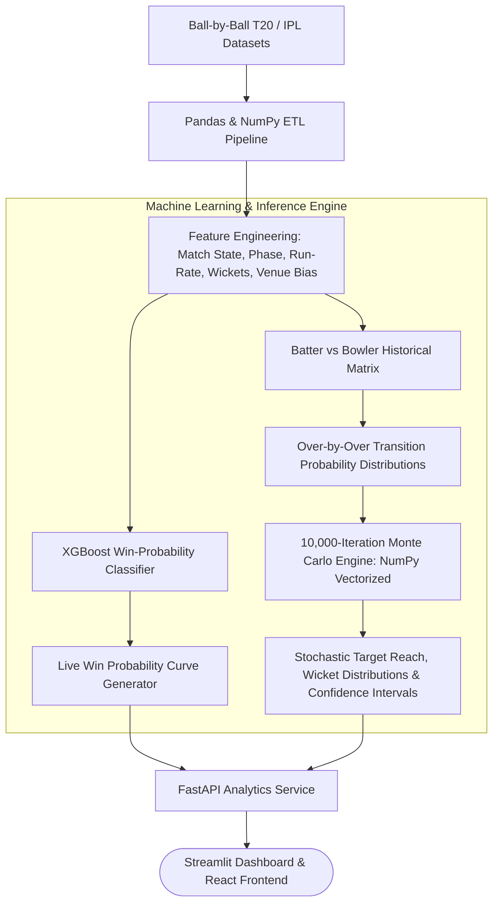

# CricPredict: ML Match Analytics & Monte Carlo Simulation Engine

[](https://www.python.org/downloads/)
[](https://fastapi.tiangolo.com)
[](https://scikit-learn.org/)
[](https://xgboost.readthedocs.io/)
[](https://pandas.pydata.org/)
[](https://numpy.org/)
[](https://opensource.org/licenses/MIT)

**CricPredict** is a machine learning and probabilistic simulation platform engineered for T20 cricket analytics. Built with **Python**, **FastAPI**, **Scikit-Learn**, and **NumPy**, it transforms ball-by-ball cricket datasets into real-time win probability curves, batter-vs-bowler historical matchup vectors, venue-adjusted run distributions, and 10,000-iteration stochastic Monte Carlo trajectory simulations.

---

## Architecture Overview



---

## Key Features

- **Vectorized Monte Carlo Simulation**: Executes 10,000 parallel match simulations in under 200ms using vectorized **NumPy** operations to project target distributions, optimal batting orders, and chase confidence intervals.
- **Dynamic Win Probability (Live In-Play)**: Evaluates ball-by-ball game states (wickets remaining, required run rate, pitch par scores, match phase) via calibrated **XGBoost** models.
- **Micro-Matchup Historical Embeddings**: Models individual batter vs bowler matchups across bowling styles (e.g. left-arm pace, leg-spin, off-spin) and phases (Powerplay, Middle, Death).
- **Venue & Dew Factor Adjustments**: Factored regressions for venue dimensions, first-innings par scores, and toss decision biases across global T20 venues.
- **High-Performance FastAPI Endpoints**: RESTful microservice designed for low-latency queries during live broadcast or decision-support scenarios.

---

## Tech Stack

| Layer | Technologies |
| :--- | :--- |
| **API & Backend** | Python 3.11, FastAPI, Uvicorn, Pydantic |
| **Data Science & ETL** | Pandas, NumPy, SciPy (Optimization & Distributions) |
| **Machine Learning** | XGBoost, LightGBM, Scikit-Learn, Joblib |
| **Visualization & UI** | Streamlit, Plotly, React / Modern CSS |
| **Storage & Data** | PostgreSQL, Parquet (Fast analytical reads), Redis (Cache) |
| **DevOps** | Docker, Docker Compose, GitHub Actions |

---

## Project Structure

```text
cricpredict-ml-engine/
├── app/
│   ├── api/
│   │   ├── v1/
│   │   │   ├── predict.py           # Win probability & target projections
│   │   │   ├── simulate.py          # Monte Carlo simulation triggers
│   │   │   └── matchups.py          # Player head-to-head metrics
│   │   └── router.py
│   ├── core/
│   │   ├── config.py
│   │   └── database.py
│   ├── etl/
│   │   ├── loader.py                # Cricsheet JSON/CSV parser
│   │   └── feature_engineering.py   # Rolling averages & pressure metrics
│   ├── ml/
│   │   ├── train.py                 # XGBoost training pipeline
│   │   ├── model_loader.py          # Serialized model inference
│   │   └── monte_carlo.py           # Vectorized stochastic simulator
│   └── main.py                      # FastAPI App
├── models/                          # Pretrained .joblib weights
├── notebooks/                       # Exploratory Data Analysis & backtests
├── docker-compose.yml
├── Dockerfile
├── requirements.txt
└── README.md
```

---

## Quickstart

### 1. Installation

```bash
git clone https://github.com/Deeps72-ux/cricpredict-ml-engine.git
cd cricpredict-ml-engine

python3 -m venv venv
source venv/bin/activate
pip install -r requirements.txt
```

### 2. Run API & Dashboard

```bash
# Start FastAPI backend
uvicorn app.main:app --port 8000 --reload

# Start Streamlit UI
streamlit run ui/dashboard.py --server.port 8501
```

---

## API Endpoints

- `POST /api/v1/predict/win-probability`: Calculate current live win probability given match state.
- `POST /api/v1/simulate/chase`: Run 10,000 Monte Carlo iterations for target chase.
- `GET /api/v1/matchup/{batter_id}/{bowler_id}`: Retrieve historical strike-rate, dot-ball %, and dismissal risk.

---

## License

MIT License.
